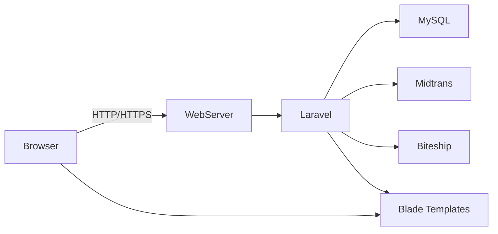

# SYSTEM DESIGN DOCUMENT (SDD)
**Pizzaria - Integrated Restaurant Management & E-Commerce System**

| Keterangan | Detail |
|---|---|
| **Nama Proyek** | Pizzaria |
| **Versi Dokumen** | 1.0.0 |
| **Tanggal Pembaruan** | 30 Juni 2026 |
| **Penyusun** | Tim Pengembang Pizzaria |
| **Stack Teknologi Utama** | Laravel 12, PHP 8.2, MySQL, Blade, JavaScript |

---

## 1. PENDAHULUAN

### 1.1 Tujuan Dokumen
Dokumen ini menjelaskan desain arsitektur perangkat lunak sistem Pizzaria, termasuk komponen backend, struktur data, alur proses, dan integrasi eksternal. Tujuannya adalah memberi panduan teknis bagi pengembang, penguji, dan pemangku kepentingan untuk implementasi dan pemeliharaan sistem.

### 1.2 Ruang Lingkup
SDD mencakup struktur aplikasi Laravel, model data utama, arsitektur API/webhook, alur proses pesanan, keamanan, dan keterbatasan sistem.

---

## 2. ARSITEKTUR APLIKASI

### 2.1 Arsitektur Tingkat Tinggi
Sistem Pizzaria diimplementasikan sebagai aplikasi web berbasis arsitektur **Client-Server**.

- **Client**: Browser pelanggan dan staf yang berinteraksi melalui HTML/Blade, JavaScript, dan CSS.
- **Server**: Aplikasi Laravel 12 menjalankan routing, controller, service, dan model.
- **Database**: MySQL menyimpan data master, transaksi, inventaris, pembayaran, dan log.
- **Layanan Eksternal**: Midtrans untuk pembayaran dan Biteship untuk logistik.

### 2.2 Komponen Utama
1. **Frontend Client**
   - Halaman katalog, checkout, status pesanan, dan halaman profil pelanggan.
   - Interaksi AJAX untuk update keranjang, polling status pesanan, dan penggunaan voucher.
2. **Frontend Admin/Cashier**
   - Panel admin untuk manajemen menu, bahan baku, promosi, dan laporan.
   - Panel kasir untuk POS, pemrosesan pesanan Dine-in, serta update status pesanan.
3. **Backend Laravel**
   - **Controllers**: Menerima request, memvalidasi input, memanggil model atau service.
   - **Models**: Eloquent ORM untuk interaksi database.
   - **Services**: Logika bisnis reusable untuk Midtrans, Biteship, dan pengelolaan stok.
   - **Middleware**: `auth`, `role`, dan keamanan request.
4. **Database**
   - Menyimpan entitas utama seperti Users, Orders, OrderItems, Menu, Category, Ingredient, Payment, Promotion, Delivery.

---

## 3. STRUKTUR DATABASE

### 3.1 Entitas Utama
1. `users`
   - Menyimpan data akun: `id`, `name`, `email`, `password`, `role`, `phone_number`.
2. `categories`
   - Kategori menu: `id`, `name`, `slug`, `sort_order`.
3. `menus`
   - Produk menu: `id`, `category_id`, `name`, `description`, `price`, `is_available`, `image_url`.
4. `ingredients`
   - Bahan baku: `id`, `name`, `stock_qty`, `unit`, `minimum_stock_alert`.
5. `customizations`
   - Opsi tambahan: `id`, `menu_id`, `ingredient_id`, `type`, `name`, `additional_price`, `ingredient_qty`.
6. `orders`
   - Transaksi pesanan: `id`, `user_id`, `order_number`, `order_type`, `order_status`, `payment_status`, `subtotal`, `total_amount`, `table_id`.
7. `order_items`
   - Item dalam pesanan: `id`, `order_id`, `menu_id`, `quantity`, `price`, `customization_id`.
8. `payments`
   - Detail pembayaran: `id`, `order_id`, `payment_method`, `status`, `transaction_id`, `amount`, `paid_at`.
9. `deliveries`
   - Data pengiriman: `id`, `order_id`, `courier_name`, `service_type`, `tracking_id`, `waybill_id`, `cost`, `status`.
10. `promotions`
   - Promosi: `id`, `code`, `discount_type`, `discount_value`, `start_date`, `end_date`, `quota`, `used_count`.

### 3.2 Relasi Utama
- `users` 1..* `orders`
- `categories` 1..* `menus`
- `menus` 1..* `order_items`
- `orders` 1..* `order_items`
- `orders` 1..1 `payments`
- `orders` 1..1 `deliveries`
- `promotions` 1..* `promotion_redemptions`

---

## 4. DESAIN KOMPUTASI & LOGIKA BISNIS

### 4.1 Alur Pemesanan Online
1. Pelanggan memilih menu, menambahkan ke keranjang, dan memilih jenis pemesanan (`delivery`, `pickup`, atau `dine_in`).
2. Sistem menghitung subtotal, diskon promo, dan total akhir.
3. Pelanggan memproses pembayaran melalui Midtrans.
4. Saat pembayaran `settlement`, webhook Midtrans mengupdate status order menjadi `paid`.
5. Order bergerak ke tahap `confirmed` lalu `cooking` saat diproses oleh kasir.
6. Setelah siap, jika `delivery`, sistem memanggil Biteship untuk pickup; jika `dine_in`, status ke `completed`.

### 4.2 Alur POS Kasir
1. Kasir login dan mengakses panel POS.
2. Kasir memasukkan pesanan dine-in atau memproses order online yang sudah dibayar.
3. Kasir menandai pesanan sebagai `processing` / `cooking`.
4. Sistem mengurangi stok bahan baku berdasarkan resep dan kustomisasi.
5. Setelah pesanan selesai, kasir menandai `ready`.

### 4.3 Layanan Webhook & API
- **Midtrans Webhook**: menerima notifikasi pembayaran dan memvalidasi signature SHA512.
- **Order Status API**: mengembalikan status pesanan terbaru bagi UI.
- **Biteship API**: menghitung ongkos kirim dan membuat order pickup ketika pesanan siap.

### 4.4 Validasi & Keamanan Input
- Semua data mutasi disaring melalui validator Laravel dan FormRequest.
- Route admin/cashier dilindungi middleware `auth` dan `role`.
- Semua formulir dilindungi CSRF, kecuali endpoint webhook server-to-server.

---

## 5. KOMUNIKASI ANTAR KOMPONEN

### 5.1 Diagram Aliran Data

### 5.2 Interaksi Modul
- **Controller** menerima request dari client.
- **Controller** memanggil **Service** untuk menjalankan logika bisnis seperti pembayaran atau pemanggilan logistik.
- **Service** mengupdate **Model** dan menyimpan perubahan ke database.
- **Controller** mengembalikan view atau JSON response.

---

## 6. RANCANGAN LAYAR & TATA LETAK

### 6.1 Frontend Pelanggan
- Menu katalog dengan filter kategori.
- Keranjang belanja melayang / summary.
- Checkout dengan pilihan metode pemesanan dan voucher.
- Halaman status order yang menampilkan progres dan ringkasan pesanan.

### 6.2 Frontend Kasir
- Layar POS berbasis grid tombol menu.
- Ringkasan pesanan di sisi kanan.
- Tombol proses, cetak struk, dan batal.

### 6.3 Frontend Admin
- Dashboard ringkasan penjualan.
- Halaman manajemen menu, kategori, bahan baku, promosi, dan staf.
- Halaman laporan ekspor PDF/Excel.

---

## 7. NON-FUNCTIONAL REQUIREMENTS

### 7.1 Skalabilitas
- Aplikasi dioptimalkan dengan query Eloquent terstruktur.
- Fitur caching dapat ditambahkan untuk menurunkan beban kueri katalog.

### 7.2 Ketersediaan
- Aplikasi idealnya dijalankan di lingkungan HTTPS.
- `APP_DEBUG=false` di lingkungan produksi.

### 7.3 Keamanan
- Hash password menggunakan Laravel `Hash::make`.
- Proteksi CSRF pada semua form user.
- Middleware otorisasi role-based untuk area admin/cashier.

### 7.4 Maintainability
- Kode dipisah dalam Controller, Model, dan Service.
- View diorganisir dalam folder khusus per modul (`admin`, `cashier`, `client`).

---

## 8. BATASAN TEKNIS

- Aplikasi mengandalkan server PHP dan database MySQL.
- Endpoint webhook tidak menggunakan CSRF, sehingga harus diamankan oleh validasi signature atau penggunaan token.
- Order tamu publik harus dibatasi agar tidak membocorkan akses status pesanan pengguna lain.

---

*Dokumen SDD ini dibuat sebagai panduan desain teknis untuk pengembangan dan pemeliharaan sistem Pizzaria.*
