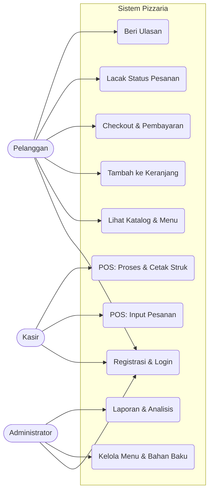

# SOFTWARE REQUIREMENTS SPECIFICATION (SRS)
**Sistem Terintegrasi Pizzaria (E-Commerce & Point of Sales)**

| Informasi Dokumen | Detail |
|---|---|
| **Nama Proyek** | Pizzaria - Integrated Management System |
| **Versi Dokumen** | 1.0.0 |
| **Tanggal Rilis** | 30 Juni 2026 |
| **Penyusun** | Tim Pengembang Pizzaria |
| **Standar Referensi** | Adaptasi IEEE 830-1998 |

---

## DAFTAR ISI
1. Pendahuluan
2. Deskripsi Keseluruhan
3. Model Kasus Penggunaan
4. Kebutuhan Fungsional Terinci
5. Antarmuka Pemrograman Aplikasi (API & Webhooks)
6. Kebutuhan Non-Fungsional
7. Batasan & Aturan Bisnis

---

## 1. PENDAHULUAN

### 1.1 Latar Belakang & Tujuan
Sistem Pizzaria dirancang untuk mengintegrasikan proses pemesanan online dan penjualan langsung melalui restoran. Tujuan utama adalah menyediakan platform yang aman, mudah digunakan, dan efisien bagi pelanggan, kasir, dan administrator untuk memproses pesanan, memantau inventaris, dan menghasilkan laporan.

### 1.2 Cakupan Sistem
Sistem ini **AKAN** menangani:
- Pemesanan pelanggan secara online (Delivery, Pickup, Dine-in) dan pemesanan langsung melalui POS.
- Otentikasi pengguna dan otorisasi role-based (Admin, Cashier, Client).
- Integrasi pembayaran dengan Midtrans untuk transaksi nontunai.
- Integrasi dengan layanan logistik/Biteship untuk pengiriman.
- Manajemen menu, kategori, bahan baku, dan promosi.
- Laporan penjualan, ekspor PDF/Excel, dan analitik dasar.

Sistem ini **TIDAK AKAN** menangani:
- Penggajian karyawan dan manajemen HR tingkat lanjut.
- Akuntansi lengkap seperti buku besar multi-entitas.
- Integrasi dengan sistem kasir fisik selain yang dirancang di dalam aplikasi.

### 1.3 Definisi & Akronim
- **POS**: Point of Sales.
- **RBAC**: Role-Based Access Control.
- **API**: Application Programming Interface.
- **OTP**: One-Time Password.
- **Webhook**: Pemberitahuan server-ke-server.

---

## 2. DESKRIPSI KESELURUHAN

### 2.1 Lingkungan Operasi
- **Server**: Nginx/Apache pada Linux atau Windows dengan PHP 8.2.
- **Framework**: Laravel 12.
- **Database**: MySQL/MariaDB.
- **Browser yang Didukung**: Chrome, Edge, Firefox, Safari.
- **Klien Mobile**: Versi responsif untuk layar smartphone.

### 2.2 Klasifikasi Aktor & Hak Akses
1. **Administrator**
   - Mengelola menu, bahan baku, promosi, staf, dan laporan.
   - Akses penuh ke panel admin.
2. **Kasir**
   - Mengelola POS, memproses pesanan, update status pesanan, dan melihat riwayat.
   - Tidak mengelola konfigurasi sistem utama.
3. **Pelanggan**
   - Melihat katalog, checkout, melacak status pesanan, dan memberikan ulasan.
   - Dapat memesan sebagai tamu atau pengguna terdaftar.

---

## 3. MODEL KASUS PENGGUNAAN

---

## 4. KEBUTUHAN FUNGSIONAL TERINCI

### 4.1 Autentikasi & Otorisasi
- **FR-1.1**: Sistem akan menyediakan form login dan register.
- **FR-1.2**: Sistem akan memvalidasi password minimal 8 karakter.
- **FR-1.3**: Admin akan memiliki akses ke route yang dilindungi oleh middleware `auth` dan `role:admin`.
- **FR-1.4**: Kasir akan memiliki akses ke route yang dilindungi oleh middleware `auth` dan `role:cashier`.

### 4.2 Manajemen Menu dan Katalog
- **FR-2.1**: Admin dapat membuat, mengedit, dan menghapus kategori menu.
- **FR-2.2**: Admin dapat membuat, mengedit, dan menghapus menu.
- **FR-2.3**: Menu hanya muncul di katalog jika `is_available` bernilai benar.

### 4.3 Keranjang & Checkout
- **FR-3.1**: Pelanggan dapat menambahkan item ke keranjang melalui AJAX atau form standard.
- **FR-3.2**: Sistem menghitung subtotal, potongan promosi, dan total akhir.
- **FR-3.3**: Pelanggan dapat memilih metode pemesanan: delivery, pickup, atau dine-in.
- **FR-3.4**: Pembayaran online dikaitkan dengan status `pending_payment` sampai webhook Midtrans menerima `settlement`.

### 4.4 Manajemen Order & Status
- **FR-4.1**: Pesanan akan memiliki status terdefinisi seperti `pending_payment`, `confirmed`, `cooking`, `completed`, `cancelled`.
- **FR-4.2**: Pelanggan dapat melihat halaman status pesanan (order status) dan polling status melalui API.
- **FR-4.3**: Pembatalan pesanan hanya diizinkan sebelum status menjadi `paid` atau `processing`.

### 4.5 Inventaris & Bahan Baku
- **FR-5.1**: Admin dapat melihat daftar bahan baku dan jumlah stok.
- **FR-5.2**: Setiap order akan mengurangi stok bahan baku sesuai resep jika pesanan diproses.
- **FR-5.3**: Sistem memberikan notifikasi stok rendah saat `stock_qty` di bawah batas `minimum_stock_alert`.

### 4.6 Promosi & Ulasan
- **FR-6.1**: Pelanggan dapat menerapkan kode promo/voucher di checkout.
- **FR-6.2**: Promo hanya valid jika masih dalam periode aktif dan kuota belum habis.
- **FR-6.3**: Pelanggan dapat menulis ulasan produk dan memberi rating setelah pesanan selesai.

### 4.7 Laporan & Ekspor
- **FR-7.1**: Admin dapat mengekspor laporan penjualan ke PDF dan Excel.
- **FR-7.2**: Dashboard admin menampilkan ringkasan penjualan harian, mingguan, dan bulanan.

---

## 5. ANTARMUKA PEMROGRAMAN APLIKASI (API & WEBHOOKS)

### 5.1 Midtrans Payment Webhook
- Endpoint: `POST /api/webhook/midtrans`
- Fungsi: Verifikasi signature SHA512 dan update status order jika pembayaran berhasil.
- Keamanan: Endpoint ini tidak menggunakan CSRF karena diakses server-ke-server.

### 5.2 Order Status API
- Endpoint: `GET /client/api/orders/{id}/status`
- Fungsi: Mengembalikan status pesanan terkini untuk tampilan order status di frontend.
- Catatan: Harus ada verifikasi kepemilikan atau token/akses teruji jika dioperasikan pada data tamu.

### 5.3 Biteship / Ekspedisi
- Endpoint eksternal: `POST /v1/orders` untuk membuat order kurir.
- Fungsi: Mengirim data alamat, layanan, dan item untuk menghasilkan waybill.

---

## 6. KEBUTUHAN NON-FUNGSIONAL

### 6.1 Keamanan
- **NFR-1**: Semua form harus dilindungi `@csrf` atau token CSRF di AJAX.
- **NFR-2**: `APP_DEBUG` harus `false` di produksi.
- **NFR-3**: Password disimpan dengan enkripsi hash yang aman.
- **NFR-4**: Route admin/cashier hanya dapat diakses oleh user terautentikasi dengan role yang sesuai.

### 6.2 Kinerja
- **NFR-5**: Halaman katalog harus dimuat cepat dengan caching halaman statis dan query teroptimasi.
- **NFR-6**: Endpoint status order harus merespons dalam waktu singkat untuk polling UI.

### 6.3 Keandalan & Skalabilitas
- **NFR-7**: Basis data harus memiliki integritas referensial antara menu, order, dan item.
- **NFR-8**: Sistem harus menangani kenaikan pengguna bersamaan saat promosi atau jam sibuk.

---

## 7. BATASAN & ATURAN BISNIS

1. Total biaya pesanan dihitung dari harga menu + harga kustomisasi + ongkos kirim - diskon.
2. Promo hanya berlaku jika tidak habis kuota dan masih aktif.
3. Pesanan online harus dibayar melalui Midtrans sebelum diproses.
4. Pelanggan hanya dapat membatalkan pesanan jika belum dibayar.
5. Stok harus direvisi setiap kali pesanan diproses dan dikunci bila bahan baku habis.

---

*Dokumen SRS ini dibuat untuk mendukung pengembangan sistem web Pizzaria dengan fokus pada integrasi POS dan e-commerce.*
